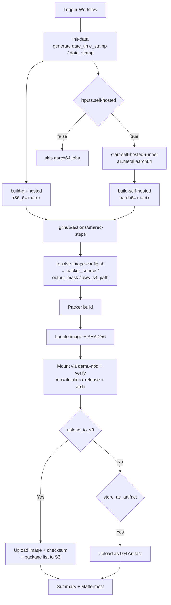

# Build GenericCloud Images

## Overview

This document covers the GenericCloud GitHub Actions workflow that builds AlmaLinux OS and Rocky Linux cloud images with Packer:

| Workflow | Display name | Image type | Document |
| :--- | :--- | :--- | :--- |
| `.github/workflows/gencloud-build.yml` | `GenericCloud: Build Image` | `gencloud` | this file |

The workflow shares:

- The `workflow_dispatch` input shape (date stamp, `distro`, `version_major`, `self-hosted`, artifact/S3/notification toggles).
- The three-job structure: `init-data` → `build-gh-hosted` (x86_64) → `start-self-hosted-runner` + `build-self-hosted` (aarch64).
- The composite action `.github/actions/shared-steps/action.yml` that drives the per-variant build / test / upload / notify logic.
- The `.github/scripts/resolve-image-config.sh` helper that resolves Packer source names, output filenames, and S3 paths.

## Workflow inputs

| Input | Type | Default | Notes |
| :--- | :--- | :--- | :--- |
| `date_time_stamp` | string | auto (`date -u +%Y%m%d%H%M%S`) | Shared timestamp so every matrix leg produces identically dated artifacts. |
| `distro` | choice | `almalinux` | `almalinux`, `rockylinux`. |
| `version_major` | choice | `10` | `10-kitten`, `10`, `9`, `8`. (`10-kitten` is AlmaLinux only.) |
| `self-hosted` | boolean | `true` | If `false`, skip the aarch64 matrix entirely. |
| `store_as_artifact` | boolean | `false` | Upload images as GitHub Actions artifacts. |
| `upload_to_s3` | boolean | `true` | Upload images + checksum + package list to the configured S3 bucket. |
| `notify_mattermost` | boolean | `true` | Post a build summary to Mattermost. |

Triggered manually from the GitHub UI: *Actions → &lt;workflow name&gt; → Run workflow*.

## Image types and variants

| Distro | Type | Workflow | Output | x86_64 variants | aarch64 variants |
| :--- | :--- | :--- | :--- | :--- | :--- |
| AlmaLinux | `gencloud` | `gencloud-build.yml` | `.qcow2` (XFS root) | `8`, `9`, `10`, `10-kitten` | `8`, `9`, `10`, `10-kitten` |
| Rocky Linux | `gencloud` | `gencloud-build.yml` | `.qcow2` (XFS root) | `8`, `9`, `10` | `8`, `9`, `10` |

## Job layout

The workflow has a three-job shape:



### `init-data`

Runs on `ubuntu-24.04`. Generates (or passes through) `time_stamp` (YYYYMMDDhhmmss) and `date_stamp` (YYYYMMDD) outputs so every matrix leg lands in the same per-build directory.

### `build-gh-hosted` (x86_64)

Runs on a GitHub-hosted Ubuntu 24.04 runner, or a RunsOn metal instance when the repository is under the `AlmaLinux` org. Invokes `./.github/actions/shared-steps` with:

- `type` — `gencloud`.
- `variant` — the per-matrix variant from the fan-out.
- `arch: x86_64`.

### `start-self-hosted-runner` (aarch64)

Runs on `ubuntu-24.04`. Gated by `if: inputs.self-hosted`. When the repository is **not** under the `AlmaLinux` org, uses [`NextChapterSoftware/ec2-action-builder@v1.10`](https://github.com/NextChapterSoftware/ec2-action-builder) to provision an `a1.metal` EC2 instance with `ec2_instance_ttl: 30`, register it as a GitHub runner, and tag it for later cleanup. For AlmaLinux-org runs this job is a no-op; RunsOn provides the aarch64 instance directly.

### `build-self-hosted` (aarch64)

Runs on:

- `runs-on={RUN_ID}/family=a1.metal/image=almalinux-9-aarch64` for AlmaLinux-org runs.
- The ephemeral EC2 runner created above (targeted by `github.run_id`) otherwise.

Dispatches a matrix over the aarch64 variants, then calls `./.github/actions/shared-steps` with `arch: aarch64` and the appropriate `type` / `variant`.

## Required GitHub configuration

### Secrets

| Secret | Description |
| :--- | :--- |
| `AWS_ACCESS_KEY_ID` | AWS access key for S3 uploads and EC2 runner provisioning |
| `AWS_SECRET_ACCESS_KEY` | AWS secret key |
| `GIT_HUB_TOKEN` | GitHub PAT for Packer plugins and self-hosted runner registration |
| `MATTERMOST_WEBHOOK_URL` | Mattermost incoming webhook URL |
| `EC2_AMI_ID_AL9_AARCH64` | AMI ID for the aarch64 self-hosted EC2 runner |
| `EC2_SUBNET_ID` | EC2 subnet for self-hosted runners |
| `EC2_SECURITY_GROUP_ID` | EC2 security group for self-hosted runners |

### Variables (`vars.*`)

| Variable | Description |
| :--- | :--- |
| `AWS_REGION` | AWS region for S3 and EC2 |
| `AWS_S3_BUCKET` | S3 bucket for image uploads |
| `MATTERMOST_CHANNEL` | Mattermost channel for notifications |

### Permissions

Every job requests `id-token: write` + `contents: read`. `contents: read` is for the `actions/checkout@v6` step.

## S3 upload layout

Uploads are placed under:

```
s3://{bucket}/images/{version_major}/{release}/{type}/{timestamp}/
```

Examples:

```
s3://almalinux-cloud/images/10/10.1/gencloud/20260220143000/AlmaLinux-10-GenericCloud-10.1-20260220.x86_64.qcow2
s3://almalinux-cloud/images/kitten/10/gencloud/20260220143000/AlmaLinux-Kitten-GenericCloud-10-20260220.aarch64.qcow2
s3://almalinux-cloud/images/9/9.5/gencloud/20260220143000/Rocky-9-GenericCloud-9.5-20260220.x86_64.qcow2
```

All uploaded objects are tagged with `public=yes`.

## Image testing

The shared action performs a minimal post-build sanity test for every cloud image:

1. Load the `nbd` kernel module.
2. Attach the built image using `qemu-nbd` (read-only).
3. Mount the root partition (partition 4 on x86_64, partition 3 on aarch64).
4. Verify `/etc/almalinux-release` or `/etc/rocky-release` matches the expected release string.
5. Verify the release package architecture.
6. Extract the installed RPM package list (uploaded next to the image).

## Packer source naming

`.github/scripts/resolve-image-config.sh` resolves the Packer source name from `type`, `version`, `arch`, and `distro`:

```
# AlmaLinux
qemu.almalinux-{version}-gencloud-{arch}      # AL 8 / 9
qemu.almalinux_{version}_gencloud_{arch}      # AL 10 / Kitten 10

# Rocky Linux
qemu.rockylinux-{version}-gencloud-{arch}     # RL 8 / 9
qemu.rockylinux_{version}_gencloud_{arch}     # RL 10
```

### Packer options by runner OS

The composite action picks different binaries depending on whether the runner is Ubuntu or RHEL-family:

| Runner OS | QEMU binary | OVMF firmware |
| :--- | :--- | :--- |
| Ubuntu | `/usr/bin/qemu-system-{arch}` | `/usr/share/OVMF/OVMF_CODE_4M.fd` |
| RHEL | `/usr/libexec/qemu-kvm` | (default) |

## Troubleshooting

1. **Packer build fails immediately** — confirm the template source exists for the `type`/`variant`/`arch` triple (see the naming rules above). Ensure the runner has `/dev/kvm` accessible and enough free disk.
2. **KVM permission denied** — the workflow configures udev rules and adds the runner user to `kvm`; on a truly manual runner you must do this yourself.
3. **Cloud image test fails** — verify the `nbd` module is loadable and that the root partition number matches your arch (4 on x86_64, 3 on aarch64). A failed `/etc/almalinux-release` check usually means Packer reused a stale partial build — clean `output-*/` directories on manual runners.
4. **S3 upload fails** — check that `AWS_ACCESS_KEY_ID` / `AWS_SECRET_ACCESS_KEY` have `s3:PutObject` + `s3:PutObjectTagging` on the bucket and that `AWS_REGION` matches the bucket region.
5. **Self-hosted runner never starts** — verify `EC2_AMI_ID_AL9_AARCH64`, `EC2_SUBNET_ID`, and `EC2_SECURITY_GROUP_ID`; the subnet's AZ must support `a1.metal`. The EC2 runner has a 30-minute TTL, so a long-stalled Packer build will eventually be reaped.

## See also

- Packer documentation: https://developer.hashicorp.com/packer/docs
- AlmaLinux Cloud SIG chat: https://chat.almalinux.org/almalinux/channels/sigcloud
